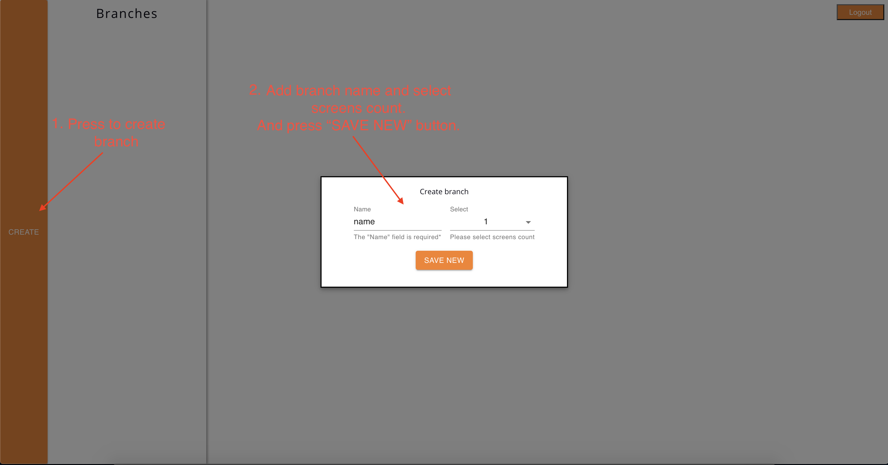

## LED Admin

An application used to create new branches and playlists for multiple LED screens, built with React, JavaScript and CSS.

## Project Screen Shot(s)

#### Login Page:

route: /login

route: /branches

route: /branches/:branchId

route: /branches/:branchId/create

The cumulative file duration on the screens must be the same to create a playlist.

## Installation and Setup Instructions

You will need `node` and `npm` installed globally on your machine.  

Installation:

`npm install`  

Create environment:

Go to src/env.js and change apiURL to your api url.

#### Example:
export const apiURL = "http://led.idb.idbank.am";

To Create Production Build:

`npm run build`  

It will create 'build' folder.

Entry file - build/index.html.
